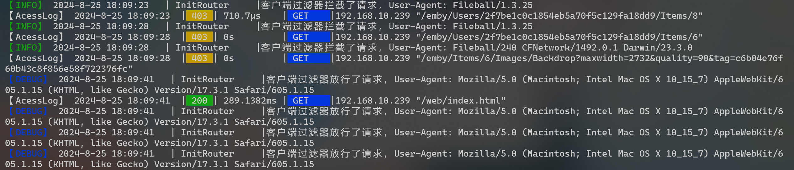
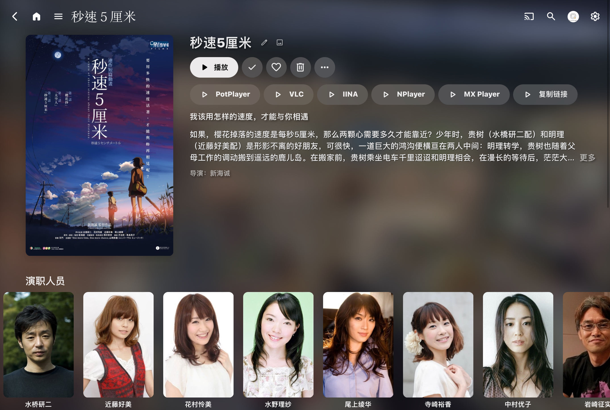
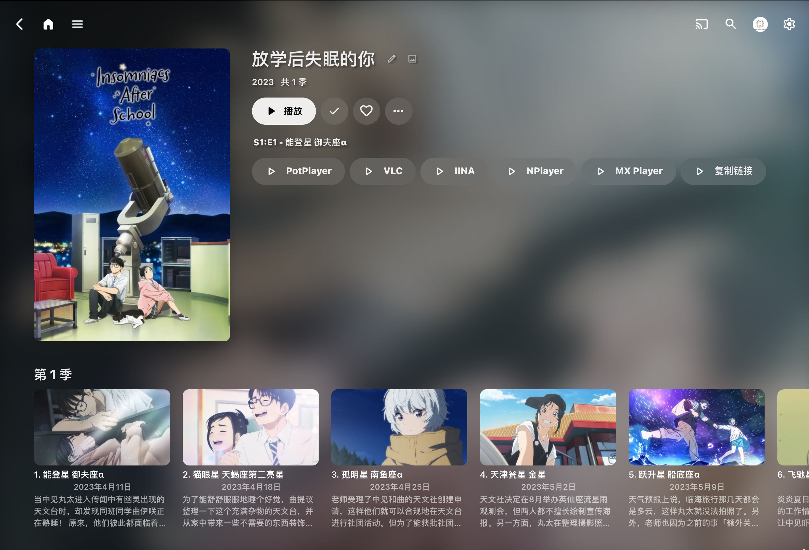

[license]: /LICENSE
[license-badge]: https://img.shields.io/github/license/Akimio521/MediaWarp?style=flat-square&a=1
[prs]: https://github.com/Akimio521/MediaWarp
[prs-badge]: https://img.shields.io/badge/PRs-welcome-brightgreen.svg?style=flat-square
[issues]: https://github.com/Akimio521/MediaWarp/issues/new
[issues-badge]: https://img.shields.io/badge/Issues-welcome-brightgreen.svg?style=flat-square
[release]: https://github.com/Akimio521/MediaWarp/releases/latest
[release-badge]: https://img.shields.io/github/v/release/Akimio521/MediaWarp?style=flat-square
[docker]: https://hub.docker.com/r/akimio/mediawarp
[docker-badge]: https://img.shields.io/docker/pulls/akimio/mediawarp?color=%2348BB78&logo=docker&label=pulls

# MediaWarp

MediaWarp 是**前置于 EmbyServer 的 反向代理服务器**，修改了原版 EmbyServer 的 API 返回内容以实现特殊功能  

[![license][license-badge]][license]
[![prs][prs-badge]][prs]
[![issues][issues-badge]][issues]
[![release][release-badge]][release]
[![docker][docker-badge]][docker]

[功能](#功能) •
[TODO LIST](#todo-list) •
[相关文档](#相关文档) •
[鸣谢](#鸣谢) •
[Star History](#star-history)

# 功能
- Strm 文件可以实现 302 直链播放，流量不经过 EmbyServer
  - **推荐配合 [AutoFilm](https://github.com/Akimio521/AutoFilm) 使用**
  - 已通过测试客户端（Web、iOS Emby、Infuse、Conflux、Fileball、Vidhub）
  - 支持Strm：
    - HttpStrm：Strm 文件内容是 http 链接，浏览器访问链接可以直接下载到视频文件（**客户端需要可以访问到该链接，MediaWarp 不需要访问到该地址**）
    - AlistStrm：Strm 文件内容是 Alist 上的路径，需要拼接 Alist 的地址可以访问到文件（**客户端无需访问到 Alist 服务器，仅需要 MediaWarp 可以访问到 Alist 服务器，但是需要可以访问到 Alist 服务器上文件的 raw_url 属性，如果使用网盘存储则无需在意这一点，但目前兼容性较差且不支持转码，通过挂载真实目录可以缓解这一问题**）

- 屏蔽特定客户端访问
  
   

- 自定义 Web 前端样式（HTML、CSS、JavaScript）
  - 效果演示：

     
    
    

- 嵌入功能
  - ExternalPlayerUrl：调用外部播放器
  - ActorPlus：隐藏没有头像的演员和制作人员
  - FanartShow：显示同人图（fanart 图）
  - Danmaku：Web 显示弹幕
  - BeautifyCSS：Emby 美化 CSS 样式

# TODO LIST
- [x] HttpStrm 实现 302 重定向
- [x] 屏蔽特定客户端访问
- [x] 提供多种 Web 前端样式
- [x] AlistStrm 实现 302 重定向
- [x] 嵌入一些实用的 JavaScript 方便使用
- [x] 缓存图片、字幕提高性能
- [x] 多格式配置文件（优先级：JSON > TOML > YAML > YML > Java properties > Java props，格式参考[config.yaml.example](./config/config.yaml.example)
- [ ] 适配 Jellyfin
- [ ] 适配 Plex

~~- [ ] 利用 Redis 做数据缓存~~
> 需求不大，放弃，有需要可以直接使用 Nginx 或者其他反向代理工具的缓存

~~- [ ] 多服务器转码推流~~
> 需求不大，放弃

~~- [ ] 利用 Mysql / PostgreSQL / Redis 优化 Infuse 媒体库模式下扫库体验~~
> 有需要可以参考 [MisakaFxxk/MisakaF_Emby/Infuse](https://github.com/MisakaFxxk/MisakaF_Emby/tree/main/Infuse) 自行实现

~~- [ ] 多服务器负载均衡~~
> 在服务器前面加一个负载均衡可能更好

# 相关文档
- [更新日志](./docs/UpdateLog.md)
- [开发文档](./docs/DEV.md)
- [User-Agent参考](./docs/UA.md)

# 鸣谢
感谢一下人员、组织提供技术支持，仓库提供相关脚本、前端样式。**排名不分先后**
- [chen3861229](https://github.com/chen3861229)
- [bpking1/embyExternalUrl](https://github.com/bpking1/embyExternalUrl)
- [newday-life/emby-front-end-mod](https://github.com/newday-life/emby-front-end-mod)
- [9channel/dd-danmaku](https://github.com/9channel/dd-danmaku)
- [Nolovenodie/emby-crx](https://github.com/Nolovenodie/emby-crx)

# Star History
 